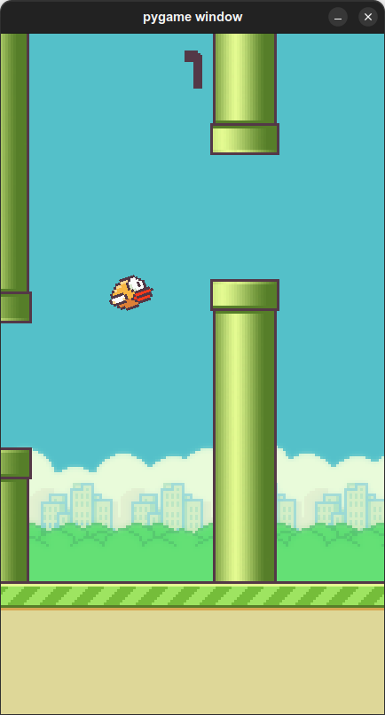
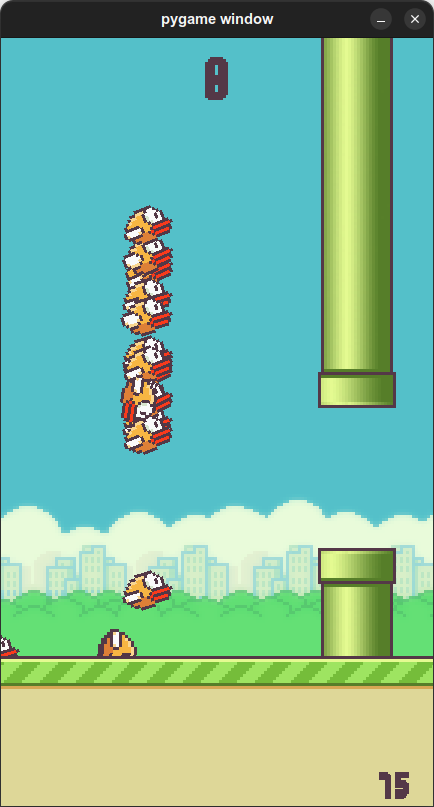
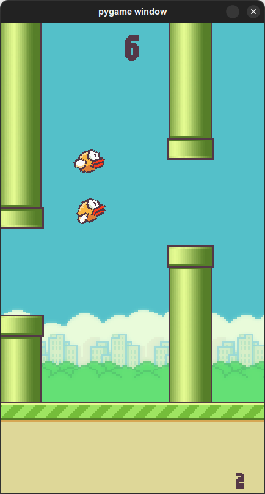

# Jogo Flappy Bird com I.A usando algoritmo genético
## Introdução
Nesse projeto, desenvolvi uma réplica do jogo
Flappy Bird e uma mini rede neural em Python,
utilizando somente as bibliotecas Pygame e
Numpy.

Com esse projeto aprendi os principais conceitos
teóricos de Machine Learning.

>O programa e o código fonte estão em português

## Requisitos
* Ter o Python instalado na versão 3.10.4 (durante o desenvolvimento, utilizei a versão 3.10.4, então não garanto que versões anteriores funcionem);
    * Ter as seguintes bibliotecas no Python:
        * numpy==1.21.6
        * pygame==2.1.2
## Como utilizar
### Instalando as bibliotecas necessárias
```bash
$ git clone https://github.com/gbPagano/flappy-bird-i.a-with-genetic-algorithm
$ cd flappy-bird-i.a-with-genetic-algorithm
$ pip install -r requirements.txt
```
### Executando o jogo
Abra o arquivo ./flappy-bird-i.a-with-genetic-algorithm/main.py e verifique a variável ```player``` na **linha 8**.

Caso queira jogar, deixe a variável com valor True:
```py
player = True
```
Caso queira que a i.a jogue, deixe a variável com valor False:
```py
player = False
```
Depois execute o script:
```bash
$ python main.py
```
---
Exemplo do jogo em modo single player:



Exemplo do jogo sendo jogado pela i.a:



